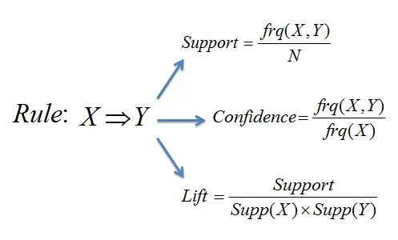

# Association Rule Mining

Association rule mining is an unsupervised machine learning technique that uses the APRIORI algorithm to uncover relationships in datasets, commonly applied in market basket analysis.\
This approach helps identify associations between items in transactions, often seen in recommendations like "Customers Also Bought."

## Sources

- [Association Rule Mining in R](https://medium.com/swlh/association-rule-mining-in-r-acbd15e0de89)
- [Groceries Dataset Association Analysis](https://rpubs.com/aru0511/GroceriesDatasetAssociationAnalysis)
- [Market Basket Analysis in R](https://www.datacamp.com/tutorial/market-basket-analysis-r)
- [Introduction to Association Rule Mining in R](https://www.kirenz.com/post/2020-05-14-r-association-rule-mining)


## Dependencies

```{r message=FALSE, warning=FALSE}
library(arules)
library(arulesViz)
library(datasets)
```

## Dataset

The Groceries dataset comprises 30 days of real-world point-of-sale transactions from a local grocery outlet, with 9835 transactions and items grouped into 169 categories.

```{r}
data("Groceries")
summary(Groceries)
```

With `itemFrequencyPlot()` function we can create an item frequency bar and view the most frequent items, in this case the top 20 items.

```{r}
itemFrequencyPlot(Groceries, topN=20) 
```

We can use `inspect()` function to display associations and transactions in a readable format.\
In this case, the first three transactions.

```{r}
inspect(head(Groceries, 3))
```

This dataset is already in a usable state for the APRIORI algorithm, so no data preprocessing is required.

## Apriori Algorithm

### Basic Concepts

The APRIORI algorithm involves three key metrics: Support, Confidence, and Lift, influencing the generation of association rules.



-   **Support** is a metric showing how often an item or item-set occurs.

-   **Confidence** is a Mathematical confidence that another item is bought given the presence of a certain item..

-   **Lift** is a correlation between two items, indicating how their occurrence together surpasses random probability.

    -   ***Lift\>1*** insinuates that the items appear together more often than they would randomly (positive relationship)

    -   ***Lift\<1*** insinuates that the items appear together less often than they would randomly (negative relationship)

    -   ***Lift=1*** insinuates that the items appear together as often as they would randomly (no relationship)

### Generating Rules

Let's generate some initial rules, using a minimum of 0.001 *support* and 0.8 *confidence* thresholds. Also use *minlen* and *maxlen* to specify the threshold of items per rule.\
These parameters can be adjusted to get different number of rules. If we want stronger rules, we increase the value of *conf,* for rules with higher frequency we increase the value of *supp*, and for more extended rules give higher value to *maxlen.*

```{r}
initial_rules <- apriori(Groceries,
                         parameter = list(supp=0.001, conf=0.8, minlen=2, maxlen=10))
```

```{r}
summary(initial_rules)
```

With the `inspect()` function we can analyse the rules created. Let's print the first 10

```{r}
options(digits=3) #3 digits in the output
inspect(initial_rules[1:10])
```

From this output we can conclude that:

-   90.5% of the time a customer buys '*liquor* and *red/blush wine'* together, they also buy'*bootled beer*'

-   Every time (100% confidence) that a customer buys '*rice* and *sugar'* together, they also buy 'whole milk'

### Redundant Rules

A rule is redundant if exists another rule, that is a subset (has less items) of that original rule, with the same of higher confidence.

The handy `is.redundant` function shows all the redundant rules

```{r}
redundant_rules <- initial_rules[is.redundant(initial_rules)]

inspect(redundant_rules)
```

Thus we can proceed to remove redundant rules from the initial set

```{r}
nonredundant_rules <- initial_rules[!is.redundant(initial_rules)]

summary(nonredundant_rules)
```


### Finding rules related to given items

Sometimes, we want to work on a specific product. If we want to find out what causes influence on the purchase of item X we can use *appearance* option in the `apriori` command. *appearance* gives us options to set **LHS (IF part)** and **RHS (THEN part)** of the rule.

#### RHS

For example, to analyze what items customers buy before buying 'yogurt' we can define *rhs* in the *appearance* option.

```{r}
yogurt_rhs_rules <- apriori(Groceries,
                            parameter = list(supp=0.001, conf=0.8,
                                             minlen=2, maxlen=10),
                            appearance = list(default="lhs", rhs="yogurt"))

inspect(yogurt_rhs_rules[1:10])
```

#### LHS

Similarly, to find the answer to the question "*Customers who bought 'yogurt' also bought...."* we define the *lhs.*

```{r}
yogurt_lhs_rules <- apriori(Groceries,
                            parameter = list(supp=0.001, conf=0.15,
                                             minlen=2, maxlen=10),
                            appearance = list(default="rhs", lhs="yogurt"))

inspect(yogurt_lhs_rules)
```

### Visualizing Association Rules

Since there can be hundreds or thousands of rules generated based on the data, you need a couple of ways to present your findings. The *arulesViz* package provides a powerful function, `plot()`, with a variety of methods to show the rules.

#### Scatter-plot

A straight-forward visualization of association rules is to use a scatter plot. It uses *Support* and *Confidence* on the axes. In addition, third measure *Lift* is used by default to color (grey levels) of the points.

```{r}
plot(nonredundant_rules, method="scatterplot", engine="plotly")
```

#### Graph-based

Graph-based techniques visualize association rules using vertices and edges where vertices are labeled with item names, and item sets or rules are represented as a second set of vertices. Items are connected with item-sets/rules using directed arrows. Arrows pointing from items to rule vertices indicate LHS items and an arrow from a rule to an item indicates the RHS. The size and color of vertices often represent interest measures.

Lets plot the top 10 rules with the highest lift, to avoid congestion in the graph.

```{r}
top10_rules <- head(nonredundant_rules, n=10, by="lift")

plot(top10_rules, method="graph", engine="htmlwidget")
```

#### Parallel Coordinates Plot

Represents the rules (or itemsets) as a parallel coordinate plot (from LHS to RHS).

```{r}
plot(top10_rules, method="paracoord")
```

**Conclusion:**

1. **Insights through APRIORI:** Application of the APRIORI algorithm to the Groceries dataset reveals valuable insights into purchasing patterns.

2. **Marketing Opportunities:** The generated rules, based on support and confidence, offer actionable information for optimizing marketing strategies and product placement.

3. **Clear Visualizations:** Graphical representation of rules enhances understanding, facilitating the quick interpretation of consumer behaviors.

4. **Data-Driven Decision-Making:** This project underscores the practical utility of APRIORI in retail transaction analysis, showcasing its pivotal role in data-driven decision-making for businesses.

